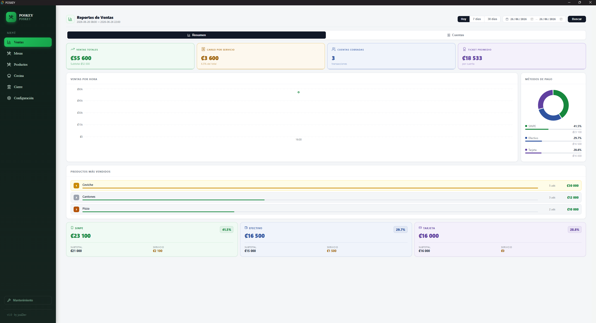
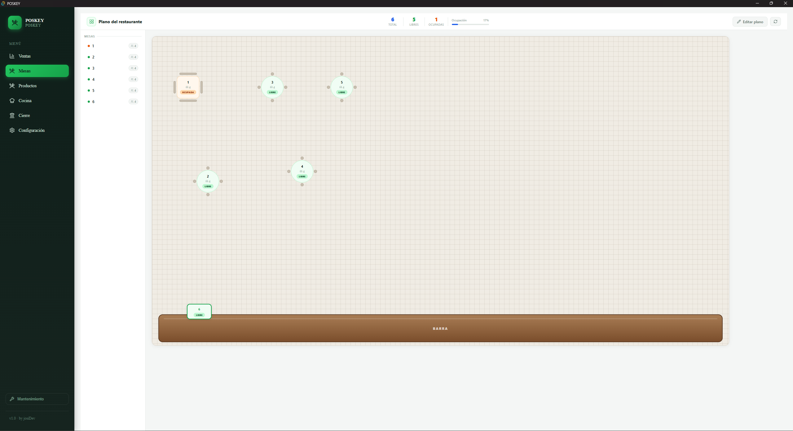
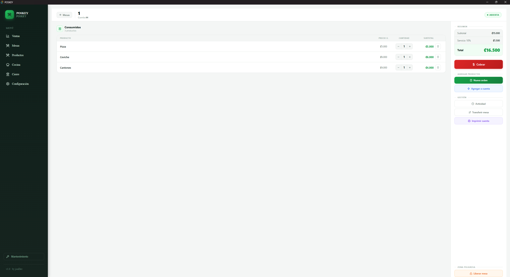
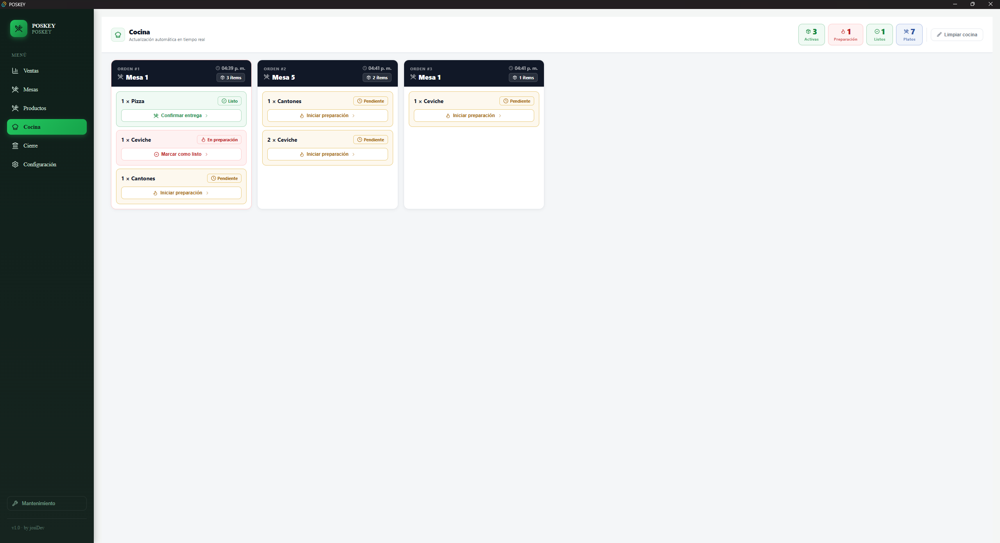
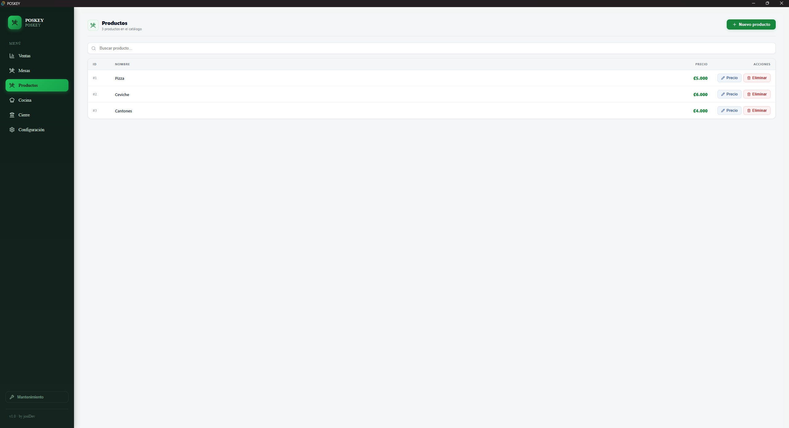
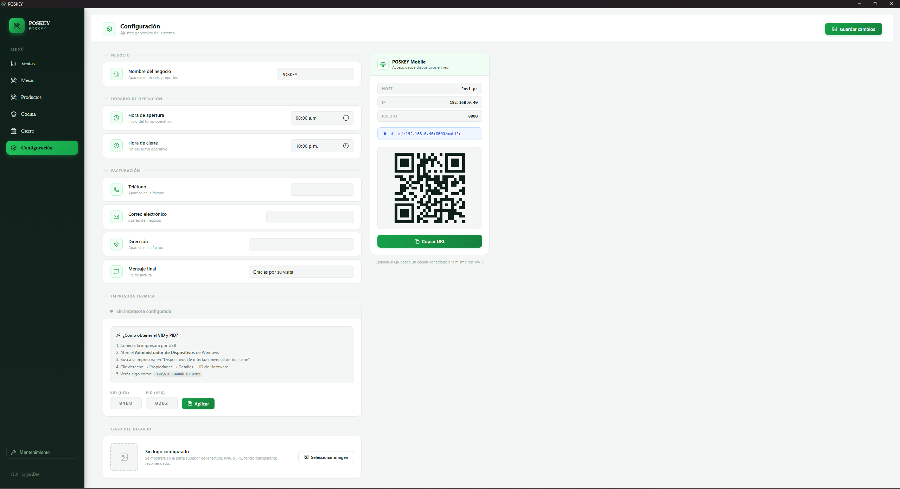
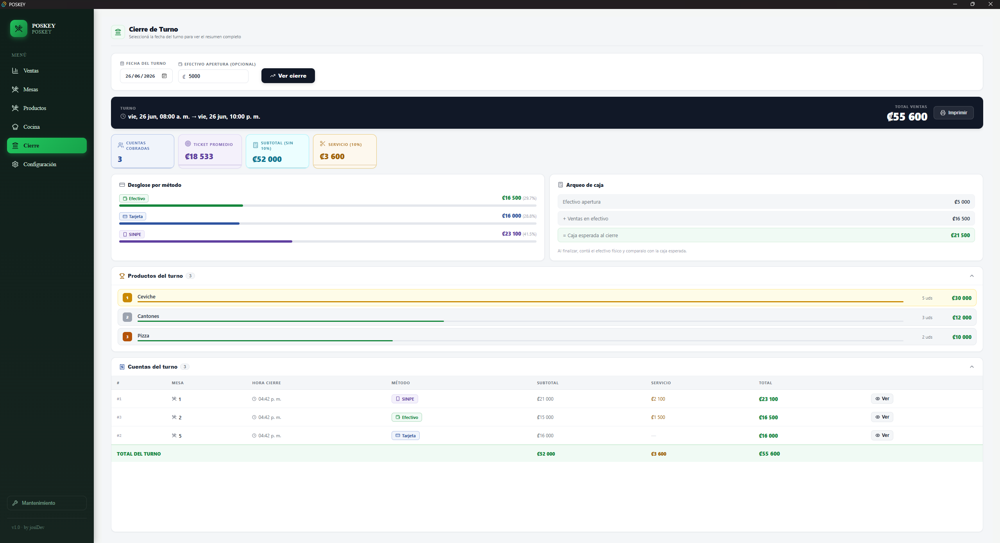
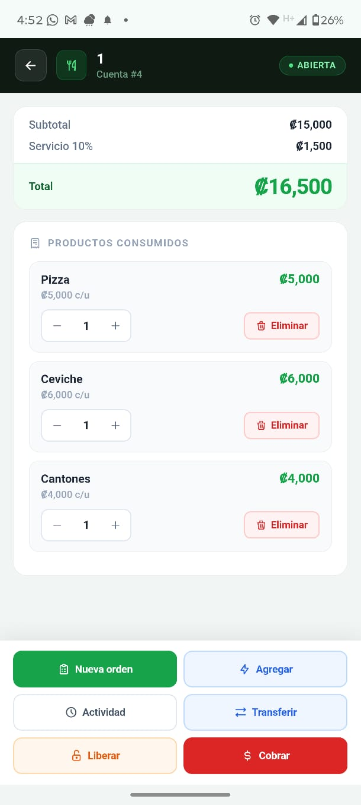
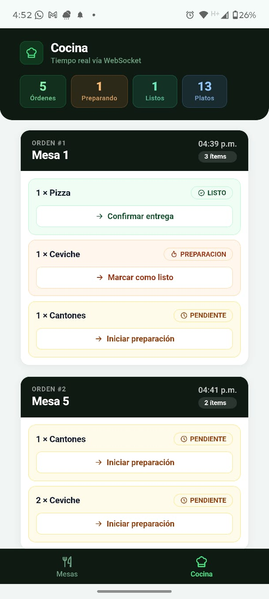
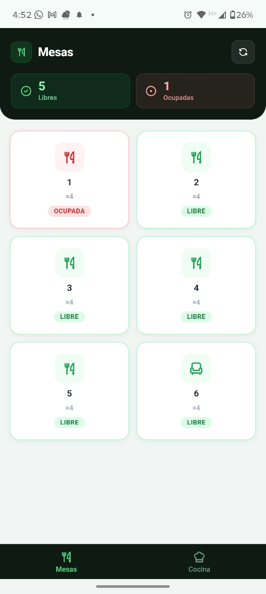

# 🍽️ Restaurant POS System

A desktop and mobile Point of Sale (POS) system for restaurants built with **React**, **TypeScript**, **Tauri**, **FastAPI**, and **SQLite**. The application streamlines restaurant operations by managing tables, orders, billing, kitchen workflows, and sales through a desktop application while providing a mobile interface for waiters and kitchen staff connected over a local network.

---

## 📌 Features

- Dynamic table management
- Order creation and tracking
- Kitchen order workflow
- Billing and payment processing
- Product management
- Local SQLite database
- Desktop application powered by Tauri
- Fast and lightweight interface

---

## 🛠️ Technologies

### Frontend
- React
- TypeScript
- Vite
- React Router
- Axios

### Backend
- Tauri (Rust)

### Database
- SQLite

### Tools
- Git
- GitHub
- Visual Studio Code

---

## 📂 Project Structure

```text
restaurant-system
│
├── src/                # React application
├── src-tauri/          # Tauri backend (Rust)
├── public/             # Static assets
├── mobile/             # Mobile resources
├── dist/               # Production build
├── package.json
└── README.md
```

---

## 🚀 Installation

Clone the repository:

```bash
git clone https://github.com/JosiVP02/restaurant-system.git
```

Install dependencies:

```bash
npm install
```

Run the application:

```bash
npm run tauri dev
```

---

## 📦 Build

Generate the production build:

```bash
npm run tauri build
```

---

## 📷 Main Modules

- Dashboard
- Table Management
- Product Management
- Order Management
- Kitchen Workflow
- Billing
- Reports

---

## 🎯 Objectives

The system was developed to improve restaurant operations by:

- Reducing manual processes.
- Simplifying order management.
- Improving communication between waiters and the kitchen.
- Providing a modern desktop solution with local data storage.

---

## 📸 Screenshots

### Dashboard / Sales



---

### Tables



---

### Order Management



---

### Kitchen



---

### Products



---

### Business Configuration



---

### End of Day Closing



---

## 📱 Mobile Login



---

## 📱 Mobile Tables



---

## 📱 Mobile Kitchen



---

### End of Day Closing


## 👨‍💻 Author

**Josimar Vallejos Paniagua**

Business Informatics Student  
University of Costa Rica

📧 josimar.paniagua02@gmail.com

GitHub:
https://github.com/JosiVP02

LinkedIn:
https://www.linkedin.com/in/josimarVP02

---


## 📄 License

This project is licensed under a custom proprietary license. See the [LICENSE](LICENSE) file for details.